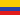

<!---->

  

Hey there! I'm [Juan Castro-Varón](https://castrovaron.com) ([🔊 pronunciation](https://jjcastro.github.io/jjcastro/pronunciation.mp3)). I'm a web developer and designer hailing from the mountains of Colombia  – now based in London   thanks to the UK's [Exceptional Talent Visa](https://castrovaron.com/blog/uk-global-talent-visa). **I currently work as a Software Engineer at Google, creating tools to stop deforestation in the Amazon rainforest with [The Nature Conservancy Brazil](https://blog.google/intl/pt-br/novidades/iniciativas/sustentabilidade-com-google-ajudando-preservar-a-floresta-amazonica/).**

### My toolkit

    
  
  
  
  

  
  
  
  
  
 
  
  
  
  
  
  
    
  
  
  
  
  
  
  
  

## Pet projects 🐰

- [flag.london](https://flag.london/)  is my proposal for London's missing flag. The website is built using [Astro](https://astro.build/) and [Svelte](https://svelte.dev/), my JS frontend frameworks of choice. 
- I developed the website as a volunteer for [Citapress.org](https://citapress.org/), a feminist [open-source](https://github.com/citapress/citapress) online library publishing books by women, founded by [@juliacastrov](https://github.com/juliacastrov). Cita is now supported by [a $750,000 grant](https://github.com/citapress/citapress/blob/832de933034deeaea1356b2ee5a9107c58af3019/assets/Mellon%20Award%202023%20%20Press%20Release.pdf) from the [Mellon Foundation](https://www.mellon.org/) and [Educopia Institute](https://educopia.org/). 

## Interesting repos 🌐

- I created a ["scrollytelling" website](http://congreso.castrovaron.com) (*in Spanish*, in partnership with [Congreso Visible](https://congresovisible.org/)) using [D3.js](https://d3js.org/) to illustrate the pro and anti-government voting patterns in the Colombian Congress, and how these have changed in the last ten years (published 2018). **[[Link to repo]](https://github.com/jjcastro/colombianSenateVotingPatterns)** 
- For my WWDC 2018 Scholarship, I created [a Swift Playground of AR experiments](https://github.com/jjcastro/wwdc-2018-scholarship) explaining computer graphics concepts such as vector algebra, plane detection and hit testing. The book also features a AR implementation of Tejo, Colombia's national sport . **[[Link to repo]](https://github.com/jjcastro/wwdc-2018-scholarship)** 
- I made a [3D gravity simulation game](https://jjcastro.github.io/gravity-game-simulation/) using WebGL where the goal is to correctly arrange moons in a 3D space to lead a projectile to the target using only the gravity of the moons. **[[Link to repo]](https://github.com/jjcastro/gravity-game-simulation)** 
- I developed a [web interface for exploring NYC water quality metrics](https://nycwater.castrovaron.com/) on a map, using the Google Maps API, showing over >10K samples of water quality data over a span of 100 years on an interactive online map of the NYC Harbor. **[[Link to repo]](https://github.com/jjcastro/nyc-harbor-water-quality)** 
